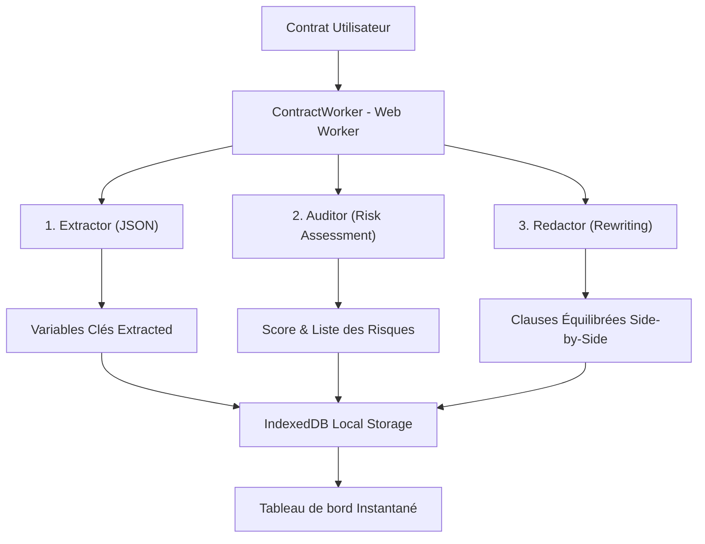

# <div align="center"></div>

<div align="center">

# 🛡️ Pactum AI
### *Votre bouclier juridique autonome, 100% local & ultra-sécurisé.*

[](https://developer.mozilla.org/en-US/docs/Web/API/WebGPU_API)
[](https://huggingface.io/google/gemma-2-2b-it)
[](https://developer.mozilla.org/en-US/docs/Web/API/IndexedDB_API)
[]()

</div>

---

## 💡 Le Problème & La Solution Pitchée

Dans le monde de l'entreprise et du droit, **la confidentialité des données est une obligation absolue**. Envoyer des contrats hautement confidentiels (accords de fusion, NDAs, contrats de travail, secrets commerciaux) sur des serveurs tiers via des API cloud présente des risques de fuite inacceptables pour les avocats et les directions juridiques.

**Pactum AI** résout ce problème fondamental grâce à l'**Edge AI** :
- **Confidentialité absolue** : Les contrats sont analysés **exclusivement dans le navigateur de l'utilisateur**, sans qu'aucune donnée ne transite sur un serveur externe.
- **Indépendance & Latence Sub-seconde** : Grâce à WebAssembly et WebGPU, Pactum fait tourner **Gemma 2 (2B-IT)** localement pour des coûts d'infrastructure nuls et une réactivité maximale hors-ligne.
- **Coût d'exploitation ZÉRO** : Aucune clé d'API payante requise, aucune base de données cloud à maintenir.

---

## 🤖 L'Architecture Multi-Agent Locale

Pactum AI orchestre une pipeline de **3 agents spécialisés autonomes** travaillant de concert à travers un **Mega-Prompt structuré** :



1. **L'Extracteur (Extractor)** : Identifie et cartographie les variables juridiques critiques (Parties prenantes, Dates clés d'effet et d'expiration, limites de responsabilité).
2. **L'Auditeur (Auditor)** : Compare les clauses du contrat aux règles commerciales standards (normes RGPD, DPA, droit OHADA) et calcule un **score de conformité de 0 à 10** en colorant les risques selon leur sévérité (*High, Medium, Low*).
3. **Le Rédacteur (Redactor)** : Propose des réécritures équilibrées et professionnelles prêtes à être insérées à la place des clauses abusives de départ.

---

## 🛠️ Stack Technique & Secret de Fabrication

- **Core & Logic** : React 19, TypeScript, Vite.
- **Moteur IA Local** : `@mediapipe/tasks-genai` (WebAssembly & WebGPU) pour le chargement et l'inférence locale ultra-rapide de **Gemma 2B IT**.
- **Inférence Multi-Thread** : Déportation de l'inférence LLM dans un **Web Worker (`contractWorker.ts`)** dédié pour éviter tout gel ou blocage de l'interface utilisateur.
- **Persistance Locale** : **IndexedDB** pour stocker et recharger instantanément l'historique complet des audits locaux de l'utilisateur sans aucun appel serveur.
- **Design System "Violet & Noir"** : Charte graphique startup premium (#000000 sombre profond, accents violets vibrants `#7c3aed`, polices *Inter* pour l'UI globale et *JetBrains Mono* pour le texte brut du contrat) utilisant **Tailwind CSS v4** et **Framer Motion** pour des micro-animations fluides.

---

## ⚡ Mode Démo "Hackathon Bulletproof"

Pour impressionner le jury sans subir la lenteur des connexions internet ou le temps de téléchargement du modèle local Gemma 2 (2 Go) lors d'un pitch :
- **Trois modes d'analyse** sélectionnables en temps réel :
  1. **Simulation (Pitch Mode)** : Un mode ultra-rapide, simulant le handoff entre les 3 agents avec une barre de progression interactive et affichant des résultats extrêmement pertinents et détaillés pour le contrat d'exemple.
  2. **Gemini Cloud API** : Appel direct à la puissance des APIs cloud Gemini.
  3. **Local Gemma 2B** : La démonstration technique finale de l'exécution WASM/WebGPU 100% hors-ligne.
- Bouton **"Load High-Risk Sample"** : Injecte instantanément un modèle de contrat "piégé" contenant des clauses abusives flagrantes (résiliation sous 2h par Slack, responsabilité illimitée, taux d'intérêt de retard usuraire de 15% par mois, etc.) pour illustrer immédiatement la réactivité de l'Auditeur.

---

## 🚀 Démarrage Rapide

### Prérequis
- [Node.js](https://nodejs.org/) (Version 18+)

### Installation

1. Clonez le dépôt GitHub :
```bash
git clone https://github.com/Codorah/pactum-ai.git
cd pactum-ai
```

2. Installez les dépendances :
```bash
npm install
```

3. Configurez les variables d'environnement (requis pour le mode Cloud Gemini uniquement) :
Créez un fichier `.env` ou `.env.local` à la racine :
```env
GEMINI_API_KEY=VotreCléAPIGemini
```

### Lancement du serveur de développement

Démarrez le serveur (Vite + Express backend pour les API cloud de repli) :
```bash
npm run dev
```

Ouvrez ensuite [http://localhost:3000](http://localhost:3000) dans votre navigateur.

---

<div align="center">
Créé avec ❤️ pour le Pitch Hackathon Pactum AI. Protégez vos accords en toute souveraineté.
</div>
