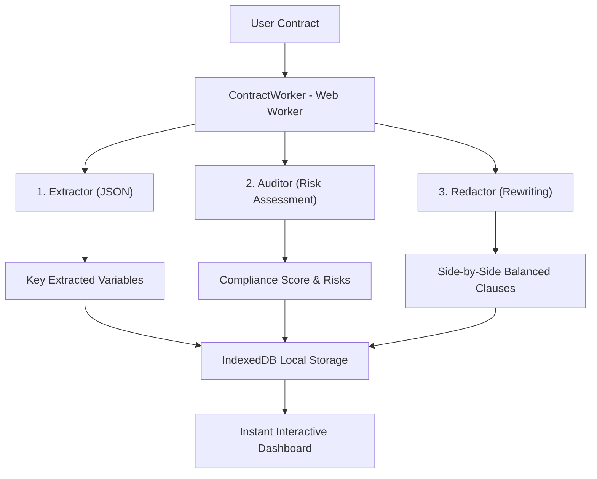

<div align="center">

# 🛡️ Pactum AI
### *Your autonomous, 100% local, sovereign & ultra-secure legal co-pilot.*

[](https://developer.mozilla.org/en-US/docs/Web/API/WebGPU_API)
[](https://huggingface.io/google/gemma-2-2b-it)
[](https://developer.mozilla.org/en-US/docs/Web/API/IndexedDB_API)
[](https://developer.mozilla.org/en-US/docs/Web/Progressive_web_apps)

</div>

---

## 💡 The Problem & The Solution

In the legal and corporate worlds, **absolute data confidentiality is a non-negotiable requirement**. Sending highly sensitive documents (NDAs, acquisition agreements, employment contracts, trade secrets) to external cloud servers or third-party APIs exposes organizations to permanent data leak risks and regulatory non-compliance.

**Pactum AI** solves this critical challenge with a **100% Edge AI** architecture:
- **Confidentiality by Design**: Contracts are analyzed **exclusively inside the user's browser**. No text, no variables, no photos ever leave the local machine.
- **Zero Infrastructure, Zero API Costs**: By leveraging WebAssembly and WebGPU, Pactum runs **Gemma 2 (2B-IT)** locally in the browser with zero server costs and full offline capabilities.
- **Automatic Multi-Language**: The interface and agent analyses automatically detect the browser's language (French / English) and offer a manual toggle in a single click.

---

## 🤖 Autonomous Local Multi-Agent Architecture

Pactum AI orchestrates a collaborative workflow of **3 specialized autonomous agents** working together through a structured **Mega-Prompt** executed locally:



1. **The Extractor (Extractor)**: Maps and identifies critical legal variables (Parties, effective/termination dates, liability caps).
2. **The Auditor (Auditor)**: Evaluates clauses against standard commercial terms, calculating a **compliance score from 0 to 10** and highlighting risks based on severity (*High, Medium, Low*).
3. **The Redactor (Redactor)**: Drafts balanced, fair, and highly professional protective rewrites to replace unfair original clauses.

---

## 🛠️ Tech Stack & Performance

- **Frontend & UX**: React, TypeScript, Vite.
- **Local AI Engine**: `@mediapipe/tasks-genai` (WebAssembly & WebGPU) enabling fast and responsive browser inference of **Gemma 2B IT**.
- **Multi-Thread Inference**: Heavy LLM calculations are delegated to a dedicated **Web Worker (`contractWorker.ts`)** to keep the user interface buttery smooth at 60 FPS.
- **Sovereign Local Storage**: **IndexedDB** stores and retrieves the user's audit history locally with zero server database calls.
- **Premium Dark Design**: A state-of-the-art "Violet & Noir" theme (#000000 deep dark, vibrant `#7c3aed` accents, *Inter* UI font, and *JetBrains Mono* for clause comparisons) using **Tailwind CSS** and **Framer Motion** for elegant micro-animations.
- **PWA (Progressive Web App)**: Service Worker-driven caching (`sw.js`) stores the heavy model `.bin` files inside the browser Cache API for instantaneous offline startup.

---

## ⚡ Pitch & Hackathon Mode

To ensure a seamless presentation regardless of network bandwidth or local model initialization time (downloading the 2GB model):
- **"Load High-Risk Sample" Button**: Instantly injects a sample contract containing flagrant unfair terms (2-hour notice termination via Slack, unlimited liability, unilateral 15%/month late fees) to demonstrate immediate legal auditing.
- **Dual Execution Engine**:
  1. **Simulation (Pitch Mode)**: An ultra-fast showcase mode that runs a simulated multi-agent analysis with animated step-by-step progress bars and high-fidelity results.
  2. **Local Gemma 2B**: The technical validation of 100% offline, decentralized WebGPU/WASM browser inference.
- **Document OCR & Import**: Drag-and-drop `.txt` or `.pdf` files, or upload photos of physical paper contracts (simulating local OCR text extraction) to trigger the agents.

---

## 🚀 Quick Start

### Prerequisites
- [Node.js](https://nodejs.org/) (Version 18+)

### Installation

1. Clone the GitHub repository:
```bash
git clone https://github.com/Codorah/pactum-ai.git
cd pactum-ai
```

2. Install dependencies:
```bash
npm install
```

3. Start the local development server:
```bash
npm run dev
```

Open [http://localhost:5173](http://localhost:5173) in your browser to experience Pactum AI completely locally with zero configuration required.

---

<div align="center">
Created with ❤️ for the Pactum AI Hackathon Pitch. Protect your agreements, keep your sovereignty.
</div>
