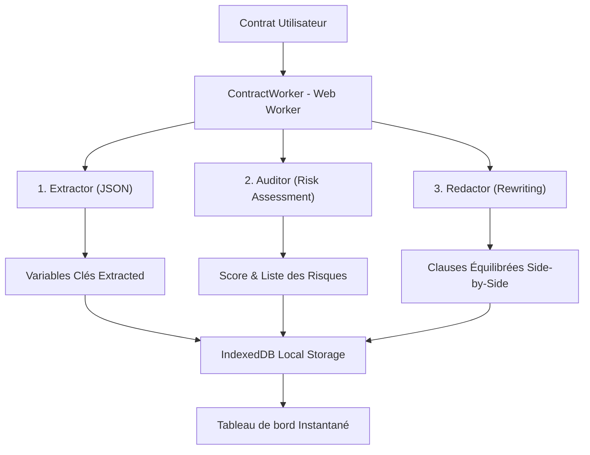

# <div align="center"></div>

<div align="center">

# 🛡️ Pactum AI
### *Votre bouclier juridique autonome, 100% local, souverain & ultra-sécurisé.*

[](https://developer.mozilla.org/en-US/docs/Web/API/WebGPU_API)
[](https://huggingface.io/google/gemma-2-2b-it)
[](https://developer.mozilla.org/en-US/docs/Web/API/IndexedDB_API)
[](https://developer.mozilla.org/en-US/docs/Web/Progressive_web_apps)

</div>

---

## 💡 Le Problème & La Solution

Dans le monde juridique et de l'entreprise, **la confidentialité absolue des données est un impératif non négociable**. Envoyer des contrats hautement confidentiels (NDAs, accords d'acquisition, contrats de travail, secrets d'affaires) vers des API ou serveurs cloud tiers crée un risque permanent de fuite de données et de non-conformité réglementaire.

**Pactum AI** résout cette impasse grâce à une architecture **100% Edge AI** :
- **Confidentialité par construction** : Les contrats sont analysés **exclusivement au sein du navigateur de l'utilisateur**. Aucun octet de texte, aucune variable, aucune photo ne quitte la machine locale.
- **Zéro infrastructure, Zéro coût d'API** : En s'appuyant sur WebAssembly et WebGPU, Pactum fait tourner **Gemma 2 (2B-IT)** localement pour des coûts serveur nuls et un fonctionnement entièrement autonome hors-ligne.
- **Double langue automatique** : L'interface et les analyses détectent automatiquement la langue du navigateur (français / anglais) et proposent une bascule manuelle en un clic.

---

## 🤖 L'Architecture Multi-Agent Locale

Pactum AI orchestre un flux collaboratif de **3 agents spécialisés autonomes** travaillant de concert à travers un **Mega-Prompt structuré** exécuté localement :



1. **L'Extracteur (Extractor)** : Identifie et cartographie les variables juridiques critiques (Parties prenantes, Dates clés d'effet et de résiliation, limites de responsabilité).
2. **L'Auditeur (Auditor)** : Analyse les clauses du contrat au regard des standards commerciaux et calcule un **score de conformité de 0 à 10** en colorant les risques selon leur sévérité (*Élevé, Moyen, Faible*).
3. **Le Rédacteur (Redactor)** : Formule des réécritures équilibrées, équitables et hautement professionnelles prêtes à être insérées à la place des clauses abusives d'origine.

---

## 🛠️ Stack Technique & Performance

- **Interface & Expérience** : React, TypeScript, Vite.
- **Moteur IA Local** : `@mediapipe/tasks-genai` (WebAssembly & WebGPU) permettant le chargement et l'inférence locale performante de **Gemma 2B IT** directement dans le moteur de rendu du navigateur.
- **Inférence Multi-Thread** : Déportation des calculs lourds de l'IA dans un **Web Worker (`contractWorker.ts`)** indépendant afin de conserver une interface utilisateur fluide et réactive à 60 FPS.
- **Base de Données Locale** : **IndexedDB** pour stocker, recharger ou supprimer localement l'historique complet des audits de l'utilisateur, préservant la souveraineté des données.
- **Design System Sombre Premium** : Charte graphique ultra-premium (#000000 sombre profond, accents violets vibrants `#7c3aed`, polices *Inter* pour l'UI et *JetBrains Mono* pour les comparateurs side-by-side de clauses) utilisant **Tailwind CSS** et **Framer Motion** pour des micro-animations fluides.
- **PWA (Progressive Web App)** : Configuration de mise en cache du modèle lourd `.bin` dans l'API Cache du navigateur (`sw.js`) pour garantir une disponibilité hors-ligne totale.

---

## ⚡ Mode Démo & Pitch Hackathon

Pour maximiser l'impact lors des présentations et des pitchs sans subir les contraintes de bande passante réseau ou le temps d'initialisation de l'IA locale (téléchargement du modèle de 2 Go) :
- **Bouton "Load High-Risk Sample"** : Injecte instantanément un modèle de contrat d'exemple piégé contenant des clauses extrêmement abusives (préavis de résiliation de 2h via Slack, responsabilité illimitée, pénalités de retard unilatérales usuraires de 15% par mois, etc.) afin d'illustrer immédiatement la réactivité de l'analyse juridique.
- **Double Mode d'Exécution** :
  1. **Simulation (Pitch Mode)** : Un mode ultra-rapide de démonstration, simulant le passage de flambeau des 3 agents avec une jauge animée et affichant instantanément le rapport juridique exhaustif et complet.
  2. **Local Gemma 2B** : La démonstration technique finale de l'exécution WASM/WebGPU 100% autonome et hors-ligne dans le navigateur.
- **Scanning Photo & Import** : Importez des fichiers (`.txt`, `.pdf`) ou téléversez directement des clichés de contrats physiques papier (simulant une capture OCR en local) pour déclencher les agents.

---

## 🚀 Démarrage Rapide

### Prérequis
- [Node.js](https://nodejs.org/) (Version 18+)

### Installation

1. Clonez le dépôt GitHub :
```bash
git clone https://github.com/Codorah/pactum-ai.git
cd pactum-ai
```

2. Installez les dépendances :
```bash
npm install
```

3. Lancez le serveur de développement local :
```bash
npm run dev
```

Ouvrez ensuite [http://localhost:5173](http://localhost:5173) (ou le port indiqué par Vite) pour accéder instantanément à Pactum AI en local avec zéro configuration requise.

---

<div align="center">
Créé avec ❤️ pour le Pitch Hackathon Pactum AI. Protégez vos accords en toute souveraineté.
</div>
